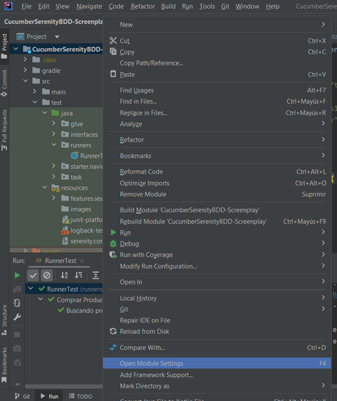
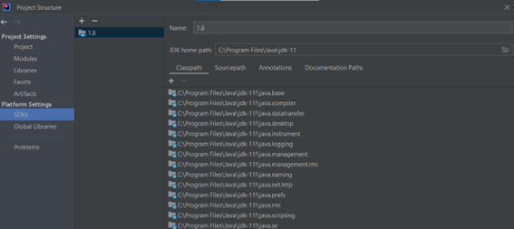
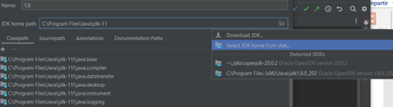

# CHALENGE NTTDATA Ejercicio E2E
Para iniciar el proyecto se utilizo un plantilla propia de serenityBDD.

Pagina : https://serenity-bdd.github.io/docs/tutorials/cucumber-screenplay

Clonar el proyecto.
Una vez clonado abrir el proyecto el IntelliJ IDEA como un proyecto maven.

# Configuracion del jdk para la compilacion

* Dar click derecho sobre el proyecto
* Seleccionar Open Module Settings

* Una vez dentro ir a la secciòn de Plattform Settings y seleccionar la opcion de SDKs

* Una vez dentro ir a JDK Home Path, seleccionar **select JDK HOME FROM DISK** y busar el jdk  de java 11 que tenga instalado en su computadora.
* Si no tiene instaldo el jdk-11, seleccionar **Dowload JDK** y descargar la ultima version.
  

Para ejecutar la prueba acceder al directorio **runners** y ejecutar el archivo **runnerTest**.

# Conclusion

* Se realizo una prueba a la pagina https://www.demoblaze.com/ en 5 pasos, las pruebas pasaron de forma exitosa.
* Esta prueba es mas utilizada para las pruebas de humo y pruebas de regresión, para verificar si no se altero la respuestas en el flujo 
con algun cambio que se implanto.
